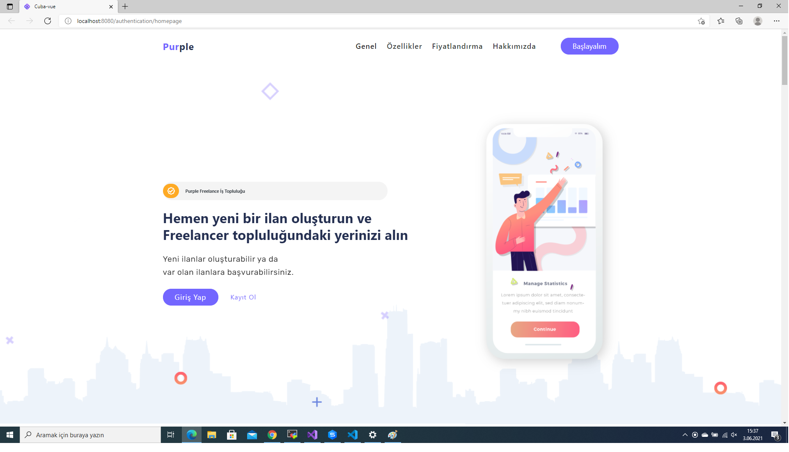
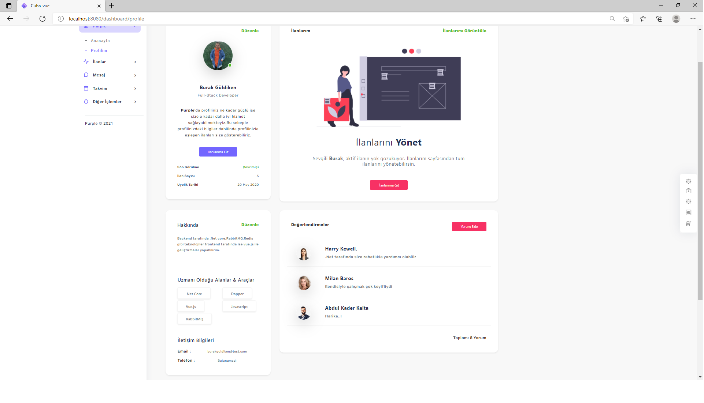

# Purple

Purple freelance veya tam zamanlı bir iş arama platformudur.Bu platformda ilan oluşturmak veya diğer kullanıcılar ile iletişime geçmek için PCoin'e ihtiyaç duyulur.

  

 
 
 
 
 
 

 

 

## Purple Nasıl Çalışır ?

Purple kullanıcıların ilan yayınlayıp iş arayış süreçlerini yönetmeyi amaçlayan bir platformdur.Yapısında bulunan Kanban Board ile iş süreçleri takım halinde geliştirilebilir.Yine yapısında bulunan takvim sayfası ile iş süreçleri planlanabilir.Burada bir başka kullanıcıyla mesaj başlatmak ve ilan yayınlama işlemleri PCoin üzerinden gerçekleşir.Sistemde 3 tür satın alınabilir paket bulunmaktadır.

 

## Geliştirilmekte Olan Kısımlar

Real-time mesaj sistemi,İş süreçlerinin yönetilmesi için Kanban Board ve Canlı destek hattı

 

## Kullanılan Teknolojiler

- .Net Core
  
- Vue.Js
  
- Redis
  
- RabbitMQ
  
- MinIO
  
- Jenkins
  
- Octopus
